# Tutorial: Proyecto con un servidor web y base de datos

Este tutorial documenta paso a paso la creación y configuración de un servidor web (PHP + Apache) y un servidor de base de datos (MariaDB) usando Docker. Cada paso incluye la captura de pantalla correspondiente, ordenada cronológicamente.

---

## 1. Descarga de imágenes Docker

Se descargan las imágenes necesarias para el proyecto.
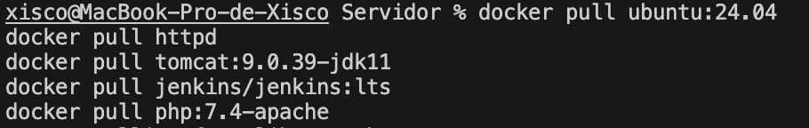

---

## 2. Visualización de imágenes descargadas

Se muestran las imágenes disponibles en el sistema.
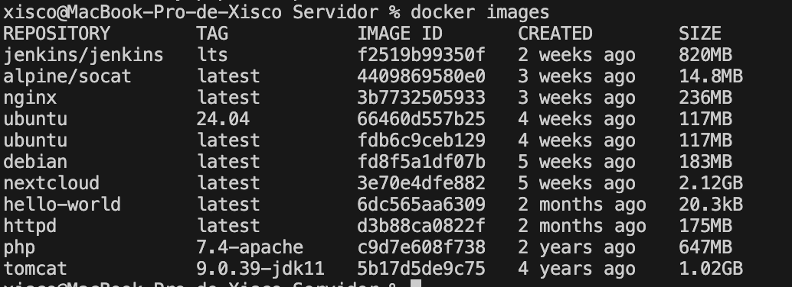

---

## 3. Creación del contenedor web (php:7.4-apache)

Se crea el contenedor en modo demonio.
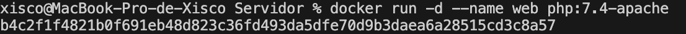

---

## 4. Comprobación del tamaño del contenedor web

Se verifica el espacio ocupado por el contenedor.
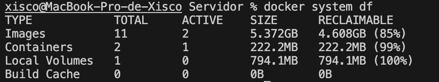

---

## 5. Copia de info.php al contenedor

Se copia el archivo info.php al directorio raíz del servicio web.
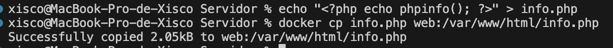

---

## 6. Comprobación del espacio ocupado tras copiar archivos

Se vuelve a comprobar el tamaño del contenedor.
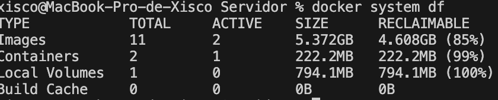

---

## 7. Acceso a info.php desde el navegador

Se accede al archivo info.php desde el navegador web.
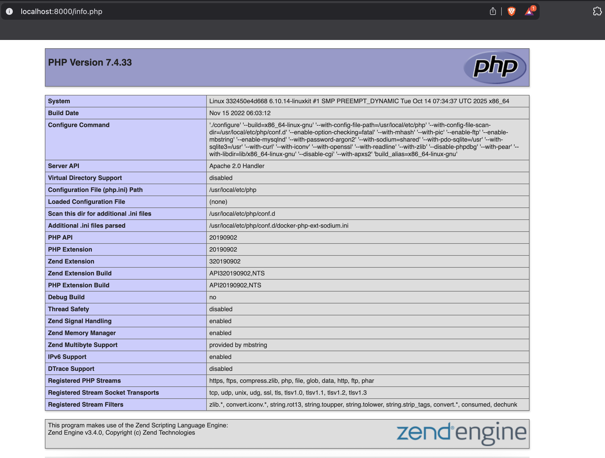

---

## 8. Creación y acceso a index.html

Se crea el archivo index.html y se accede desde el navegador.
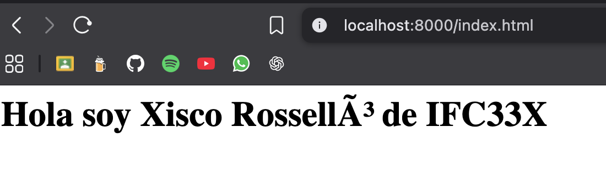

---

## 9. Creación y acceso a index.php

Se crea el archivo index.php y se accede desde el navegador.
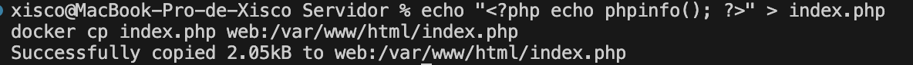

---

## 10. Acceso a index.php tras ajustes

Se comprueba el acceso correcto tras ajustes en el contenedor.
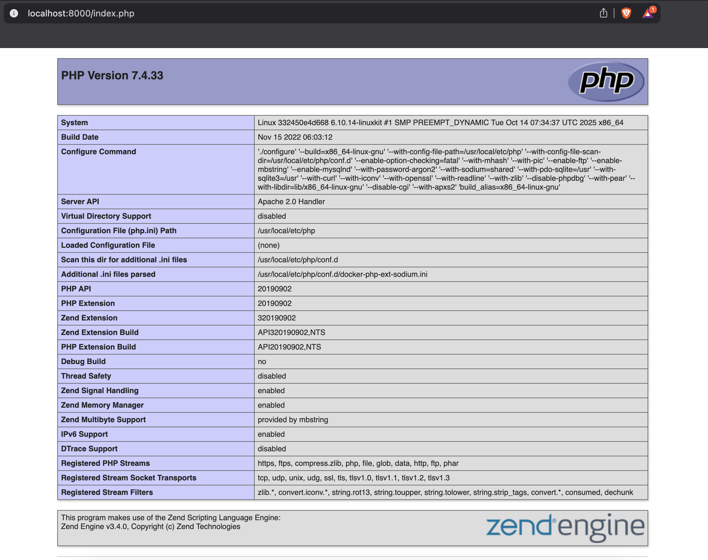

---

## 11. Arranque del contenedor MariaDB y conexión desde cliente externo

Se arranca el contenedor de base de datos y se conecta desde un cliente externo para verificar la base de datos creada.
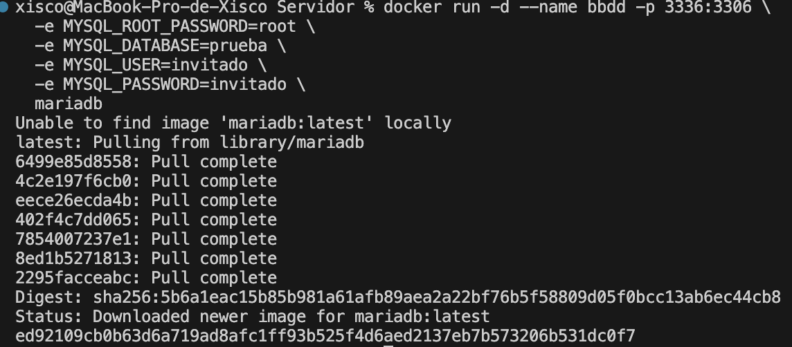

---

## 12. Verificación de base de datos creada

Se muestra la base de datos 'prueba' creada automáticamente.
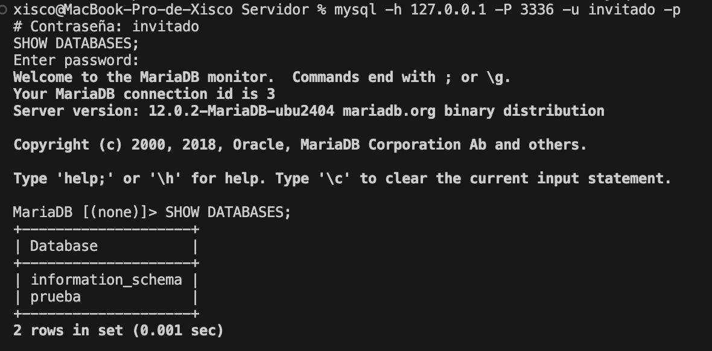

---

## 13. Error al intentar borrar la imagen mariadb con el contenedor activo

Se intenta borrar la imagen mariadb y se documenta el error.
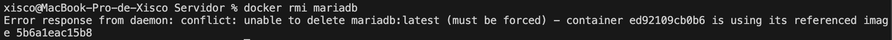

---

## 14. Comprobación final del entorno

Se realiza una comprobación final del entorno y los contenedores.
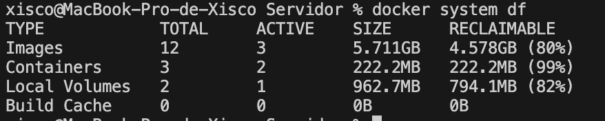

---

## 15. Estado final y cierre del proyecto

Se documenta el estado final y cierre del proyecto.

---

**Autor:** Xisco Rosselló
**Fecha:** 3 de noviembre de 2025
